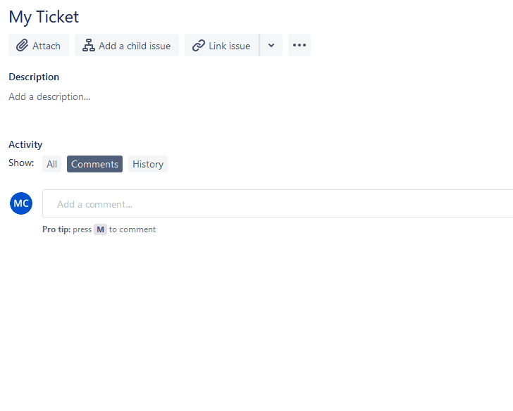

# Jira Template Filler

Automatically fill in the Description field with a pre-made HTML template.

Works ONLY on "next-gen" projects, and only in the full screen ticket edit view (not Create issue markdown editor)

You can supply your own template in the toolbar menu by clicking on the icon.

### Example Usage

